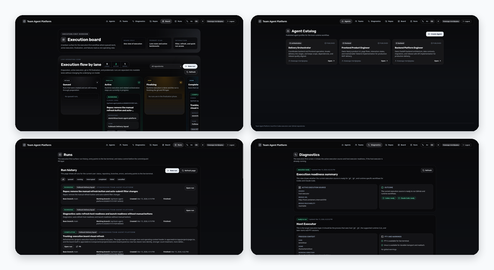
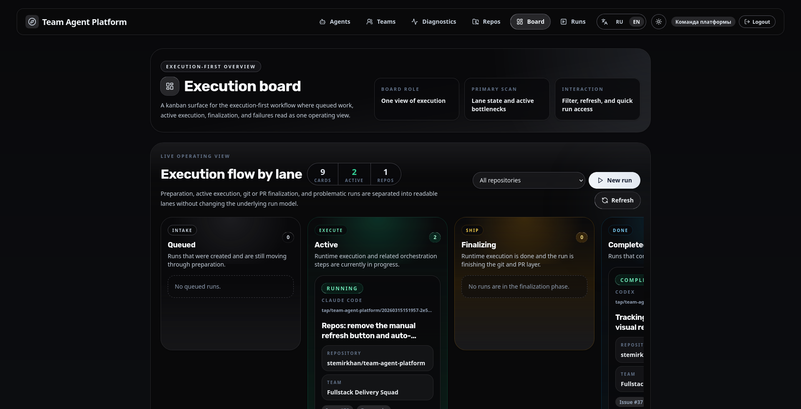
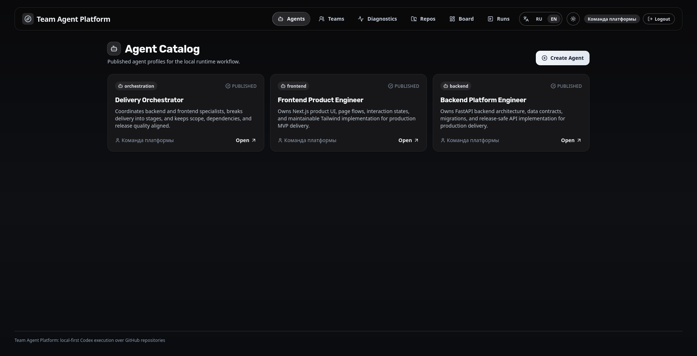
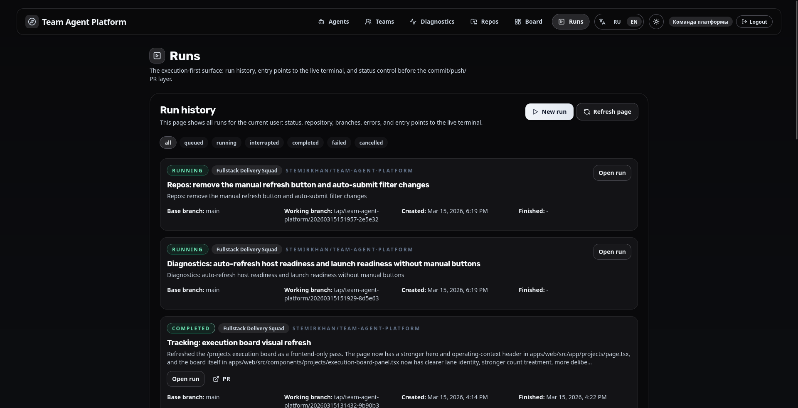
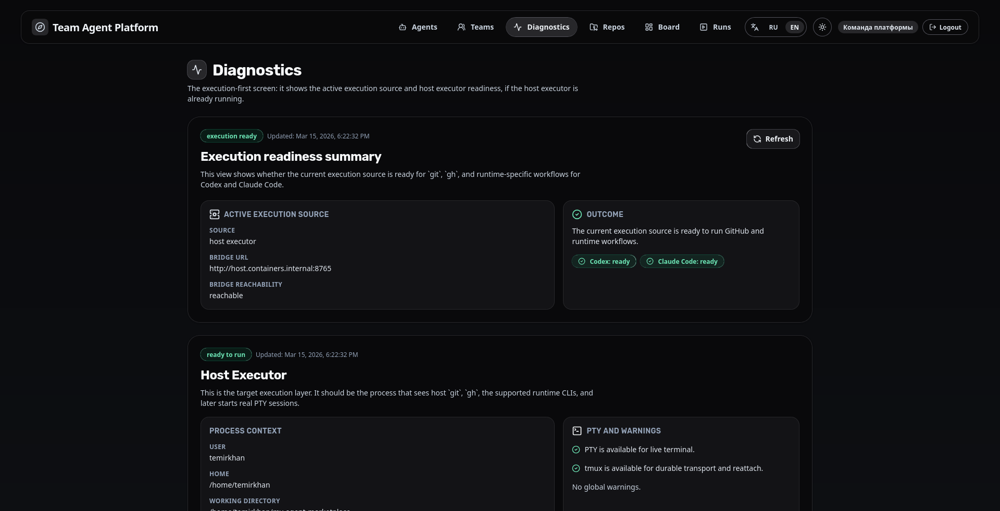
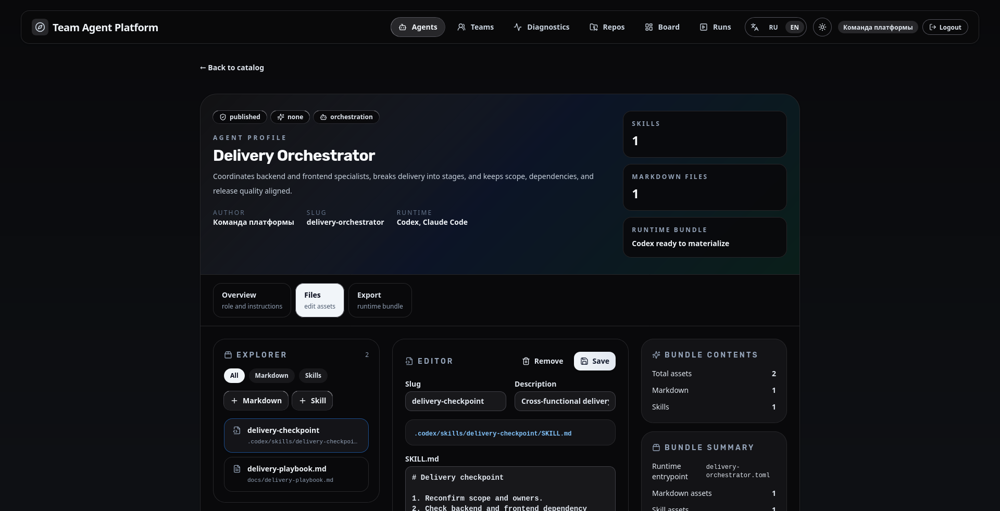
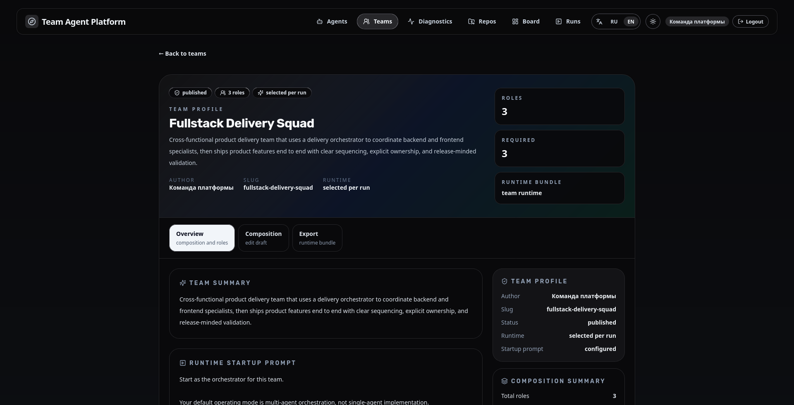
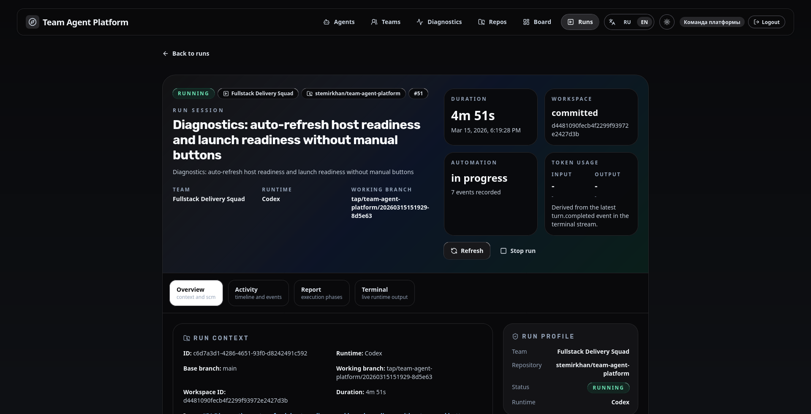
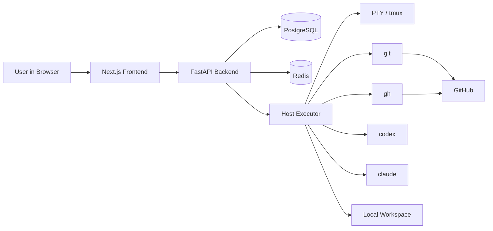

# Team Agent Platform

<p align="center">
  <strong>Local-first execution for Codex- and Claude-powered agent teams on real GitHub repositories.</strong>
</p>

<p align="center">
  <a href="#screenshots">Screenshots</a> •
  <a href="#architecture-at-a-glance">Architecture</a> •
  <a href="#quick-start">Quick Start</a> •
  <a href="#documentation">Documentation</a>
</p>

<p align="center">
  <a href="LICENSE">
    
  </a>
  
  
  
</p>

<p align="center">
  
</p>

<p align="center">
  <sub>From repository selection and diagnostics to live runtime sessions, recovery-aware execution, and draft PR delivery.</sub>
</p>

> Team Agent Platform is not a hosted public catalog or social discovery product.
> The current MVP is a self-hosted control plane plus a host execution layer that runs authenticated local tools such as `git`, `gh`, `codex`, and `claude`.

## Screenshots

<p align="center">
  
  
</p>
<p align="center">
  
  
</p>

<details>
  <summary>Open the full screenshot gallery</summary>

  <p align="center">
    
    
  </p>
  <p align="center">
    
  </p>
</details>

## Architecture At A Glance

The system has two main layers:

- `Control Plane`:
  Next.js frontend, FastAPI backend, PostgreSQL, Redis.
- `Host Execution Layer`:
  Host Executor, `codex`, `claude`, `gh`, `git`, PTY or `tmux`, and local workspaces.



The browser talks to the backend. The backend orchestrates runs and stores state. The host executor runs in the host user context, where `git`, `gh`, and the selected runtime CLI are already installed and authenticated.

See the deeper architecture documents here:

- [Architecture Overview](docs/architecture-overview.md)
- [Runtime Boundary RFC](docs/runtime-boundary-rfc.md)
- [Run Resume and Recovery](docs/run-resume-recovery-plan.md)
- [Live-Fire Validation Plan](docs/live-fire-validation-plan.md)

## Run Flow

At a high level, one run goes through these stages:

1. create a run from the UI;
2. prepare a workspace;
3. clone the repository and create a working branch;
4. materialize the runtime bundle and `TASK.md`;
5. start the selected runtime in the host execution layer;
6. stream terminal output and run events;
7. clean temporary runtime files from the workspace;
8. create a commit when the runtime produced repository changes;
9. require the runtime to finalize commit, push, and draft PR from the prepared workspace;
10. fail the run if the runtime exits without fully finishing SCM delivery.

For Codex-backed runs, the normal launch flow now fixes the root session sandbox to
`danger-full-access`. The runtime owns SCM finalization, so it must be able to write `.git`,
push the working branch, and create the draft PR from the prepared workspace.

If the host executor or transport is interrupted, the platform supports resume and auto-recovery for recoverable sessions.

## Quick Start

### Fastest Way To Launch Everything

```bash
cp .env.example .env
./scripts/dev/up.sh
./scripts/setup/host-executor-local.sh
tmux new-session -d -s tap-host-executor 'cd /absolute/path/to/this/repo && HOST_EXECUTOR_RELOAD=0 ./scripts/dev/run-host-executor.sh'
```

Use `./scripts/dev/up.sh --build` only when Dockerfiles or dependency manifests changed.

Then open:

- frontend: `http://localhost:3000`
- backend docs: `http://localhost:8000/docs`
- diagnostics: `http://localhost:3000/diagnostics`
- runs: `http://localhost:3000/runs`
- repositories: `http://localhost:3000/repos`

To stop everything:

```bash
tmux kill-session -t tap-host-executor || true
./scripts/dev/down.sh
```

To inspect the host executor directly:

```bash
tmux attach -t tap-host-executor
```

### Step-By-Step Startup

1. Create a local environment file:

```bash
cp .env.example .env
```

2. Start the control plane:

```bash
./scripts/dev/up.sh
```

If you changed Dockerfiles or dependency manifests, rebuild explicitly:

```bash
./scripts/dev/up.sh --build
```

3. Start the host executor in a separate terminal:

```bash
./scripts/setup/host-executor-local.sh
./scripts/dev/run-host-executor.sh
```

4. Open the application:

- frontend: `http://localhost:3000`
- backend docs: `http://localhost:8000/docs`
- diagnostics: `http://localhost:3000/diagnostics`
- runs: `http://localhost:3000/runs`
- repositories: `http://localhost:3000/repos`

5. Stop the control plane:

```bash
./scripts/dev/down.sh
```

## Host Requirements

<details>
  <summary>Required tools and auth checks</summary>

```bash
git --version
gh --version
gh auth status
gh auth setup-git
codex --help
codex login status
claude --version
claude auth status
```

Minimum expectations:

- `git` is installed
- `gh` is installed and already authenticated
- at least one supported runtime CLI is installed and already authenticated
- the host executor runs under the same OS user that owns those CLI sessions
</details>

## Repository Layout

```text
apps/
  backend/        FastAPI, SQLAlchemy, Alembic
  web/            Next.js, TypeScript, Tailwind, shadcn/ui
  host-executor/  Host-side execution bridge for codex, claude, gh, git, PTY, and tmux
docs/             Architecture and operational documentation
images/           README and product screenshots
infra/            Local compose setup and infrastructure assets
scripts/          Local development and operational scripts
```

## Local Validation

Backend:

```bash
cd apps/backend
python3 -m venv .venv
. .venv/bin/activate
pip install -e '.[dev]'
python -m ruff check app tests
python -m pytest
```

Frontend:

```bash
cd apps/web
npm install
npm run lint
npm run build
```

## Documentation

- [Architecture Overview](docs/architecture-overview.md)
- [Runtime Boundary RFC](docs/runtime-boundary-rfc.md)
- [Run Resume and Recovery](docs/run-resume-recovery-plan.md)
- [Live-Fire Validation Plan](docs/live-fire-validation-plan.md)
- [Contributing](CONTRIBUTING.md)

## Open-Source Direction

This repository is being prepared for open development.

That means:

- public-facing documentation should be in English;
- product and architecture intent should live in versioned docs inside the repository;
- current guidance should come from this README and the docs listed above.

## License

This project is released under the [MIT License](LICENSE).
