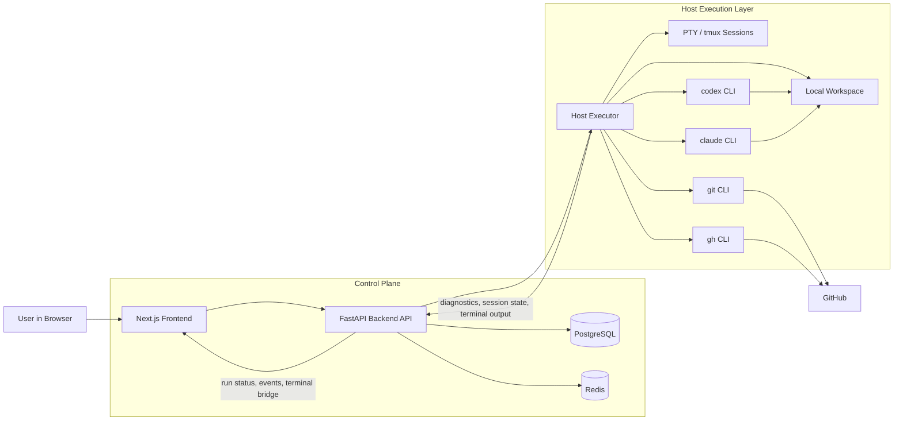
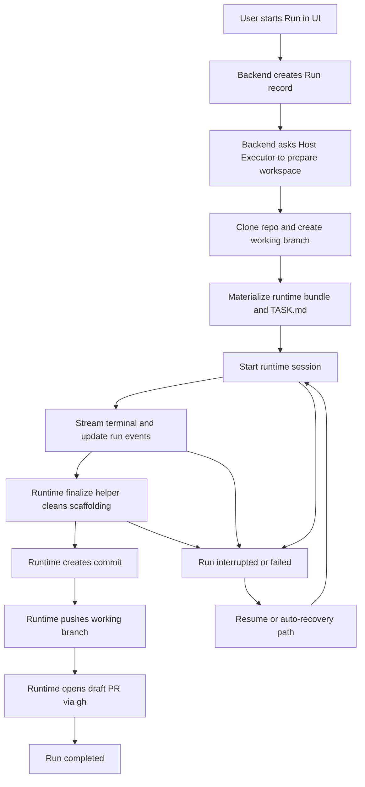

# Architecture Overview

This document gives a high-level view of the platform architecture without diving into internal implementation details.

For the current runtime-boundary refactor and Claude Code reconciliation, see [Runtime Boundary RFC](runtime-boundary-rfc.md).

In short:

- `Frontend` and `Backend` form the control plane.
- `Host Executor` runs in the host user context and has access to local `git`, `gh`, `codex`, and `claude`.
- `Backend` owns run lifecycle reconciliation, persists state in `PostgreSQL`, and serves status, history, and terminal data to the UI.
- `Host Executor` prepares workspaces, starts runtime sessions, and performs git/GitHub operations.
- `Host Executor` should stay bound to loopback by default and only accept backend calls authenticated by a shared secret header.
- GitHub remains the external source for repositories, issues, and draft PRs.

## Run Lifecycle

The diagram below shows the simplified lifecycle of a single `run`.

In short:

- a run is initiated from the UI, but orchestrated by the backend;
- the host executor prepares the workspace and starts the selected runtime;
- terminal output and run events flow back through the backend and into the UI;
- active run lifecycle is advanced by a backend-owned background reconciler, not by `GET /runs*` reads;
- on success, the runtime must finish commit, push, and draft PR creation inside the prepared workspace;
- for Codex runs, that contract implies a `danger-full-access` root sandbox in the normal run
  flow so the runtime can complete `.git` writes and GitHub delivery itself;
- if the runtime exits without fully finishing SCM delivery, the backend marks the run as failed instead of completing SCM on its behalf;
- on failure or interruption, the platform may use resume or auto-recovery when session state is still available.

## Runtime model

The platform is now multi-runtime in practice:

- `codex`
- `claude_code`

The current runtime boundary is:

- one shared run pipeline in the backend for workspace preparation, runtime execution, lifecycle reconciliation, and delivery-state validation
- one backend runtime adapter registry for bundle materialization, session start/resume/cancel/get-events, terminal normalization, and execution-trace extraction
- one shared host session engine for PTY or `tmux` lifecycle, recovery bookkeeping, and chunk persistence
- runtime-specific host modules for command building, session-id semantics, and output parsing

The main remaining compatibility debt is in persisted legacy fields and status labels:

- `runtime_session_id` is the primary durable session identity
- `codex_session_id` and `claude_session_id` still remain as backward-compatible mirrors
- `starting_codex` is still accepted as a legacy status value and mapped into the generic runtime phase

Claude and Codex both feed the same run details surface, but execution-trace extraction is runtime-specific:

- Codex uses structured collaboration tool-call signals
- Claude Code uses structured `Agent` tool and `task_started` signals from `stream-json`

The implementation details and remaining cleanup items are described in [Runtime Boundary RFC](runtime-boundary-rfc.md).
