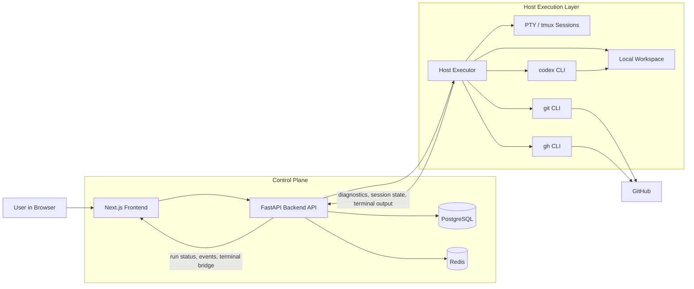
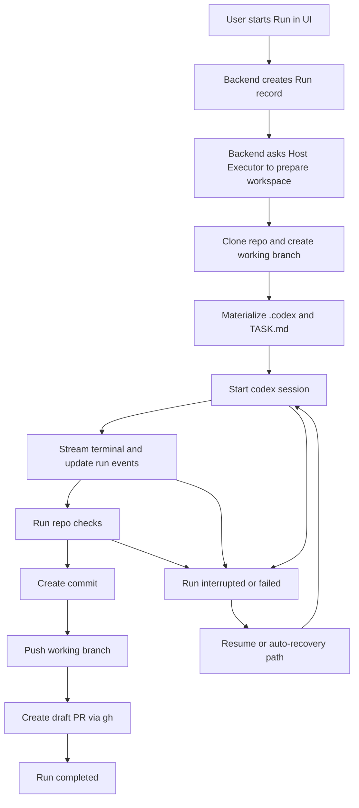

# Architecture Overview

This document gives a high-level view of the platform architecture without diving into internal implementation details.

In short:

- `Frontend` and `Backend` form the control plane.
- `Host Executor` runs in the host user context and has access to local `git`, `gh`, and `codex`.
- `Backend` orchestrates the run lifecycle, persists state in `PostgreSQL`, and serves status, history, and terminal data to the UI.
- `Host Executor` prepares workspaces, starts Codex sessions, and performs git/GitHub operations.
- GitHub remains the external source for repositories, issues, and draft PRs.

## Run Lifecycle

The diagram below shows the simplified lifecycle of a single `run`.

In short:

- a run is initiated from the UI, but orchestrated by the backend;
- the host executor prepares the workspace and starts `codex`;
- terminal output and run events flow back through the backend and into the UI;
- on success, the flow ends with commit, push, and draft PR creation;
- on failure or interruption, the platform may use resume or auto-recovery when session state is still available.
